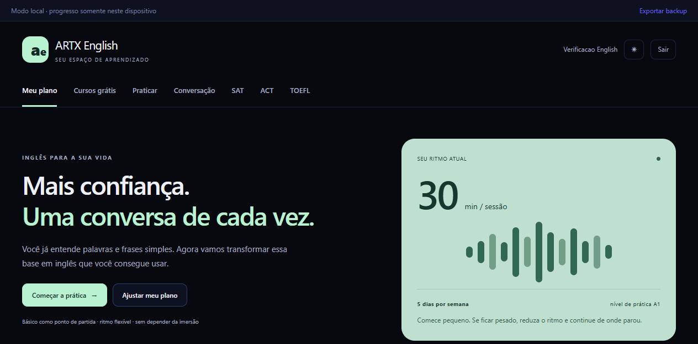

# SAT & English Learning

A bilingual learning platform that combines daily English practice with SAT-style adaptive exams and dedicated SAT, ACT and TOEFL study tracks. It was designed as a practical, measurable study system rather than a collection of disconnected exercises.

[Open the live application](https://sat-simulado.vercel.app)



## Key capabilities

- Structured English curriculum with daily learning plans.
- Reading, vocabulary, conversation and spaced-repetition practice.
- Separate SAT, ACT and TOEFL preparation tracks.
- SAT-style Reading & Writing and Math exam flow with adaptive second modules.
- Timers, question navigation, answer elimination, review flags and formula reference.
- Progress history, score trends and domain-level performance views.
- Local-first IndexedDB storage with exportable progress.
- Optional Supabase sync using the same authenticated session as ARTX Hub.
- Optional server-side LLM generation; provider credentials never reach the browser.
- Responsive interface with Portuguese contextual translation support.

## Tech stack

React 19, TypeScript, Vite, Tailwind CSS, Zustand, Dexie/IndexedDB, Supabase, Vitest, Recharts and KaTeX.

## Local development

```powershell
npm.cmd install
npm.cmd run dev
```

Optional configuration:

| Variable | Purpose |
| --- | --- |
| `LLM_BASE_URL` | Server-side OpenAI-compatible endpoint |
| `LLM_MODEL` | Server-side model identifier |
| `LLM_API_KEY` | Server-only provider credential |
| `VITE_SUPABASE_URL` | Optional Supabase project URL |
| `VITE_SUPABASE_PUBLISHABLE_KEY` | Optional public client key for authenticated sync |

Copy `.env.example` to `.env.local` for local configuration. Never commit real keys.

## Verification

```powershell
npm.cmd run lint
npm.cmd run test
npm.cmd run build
npm.cmd audit --omit=dev
```

## Repository map

```text
api/              Serverless content-generation endpoint
src/components/   Shared exam and learning UI
src/data/         Learning content and question banks
src/lib/          Storage, sync, scoring and learning engines
src/pages/        Learning, exam and progress screens
src/store/        User and active-exam state
tests/            Storage, learning and regression tests
```

## Academic disclaimer

This is an independent educational project. It is not affiliated with or endorsed by College Board, ACT or ETS. Exam scoring is an approximation for practice and must not be presented as an official score.

## Status

Active personal learning platform. Local mode works without an account; cross-device sync and generated exercises require their optional services to be configured.

Built and maintained by [Kauã Diniz Souza](https://github.com/Kauadsouza).
